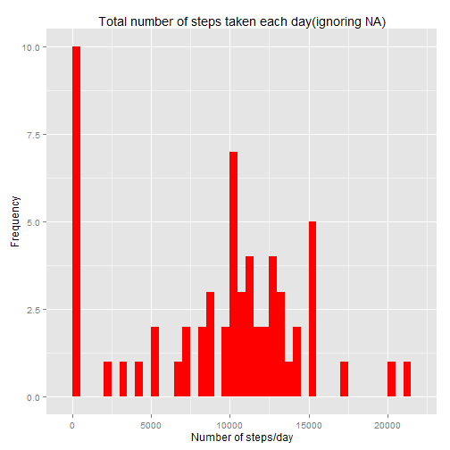
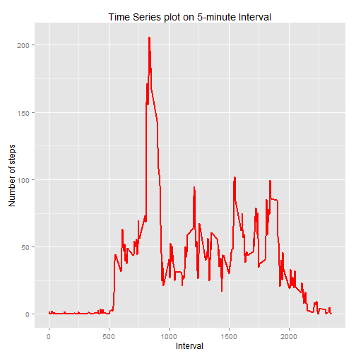
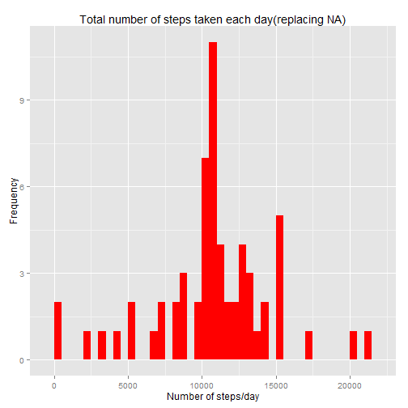
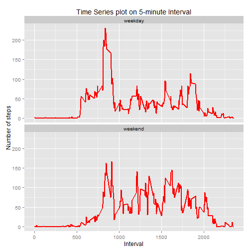

```r
library(knitr)

opts_chunk$set(echo = TRUE, message = FALSE  , warning = FALSE)
```


##Loading data


```r
library(lubridate)
library(dplyr)
library(ggplot2)
activity_data<-read.csv("activity.csv")
head(activity_data)
```

```
##   steps       date interval
## 1    NA 2012-10-01        0
## 2    NA 2012-10-01        5
## 3    NA 2012-10-01       10
## 4    NA 2012-10-01       15
## 5    NA 2012-10-01       20
## 6    NA 2012-10-01       25
```

##Pre Processing of data

```r
activity_data$date<-as.Date(as.character(activity_data$date),"%Y-%m-%d")
percentage_na<-sapply(activity_data,function(x){
        paste(round(100*(mean(is.na(x))),2),"%")})
percentage_na
```

```
##     steps      date  interval 
## "13.11 %"     "0 %"     "0 %"
```
The table above gives the percentage of NA data in each of the columns. The only column that has NA data is "steps"

###What is mean total number of steps taken per day?

The code below groups the data by date and sums the steps for each date.

```r
sum_extract<-activity_data %>% 
        group_by(date) %>%
        summarise(num_steps=sum(steps,na.rm=TRUE))
head(sum_extract)
```

```
## Source: local data frame [6 x 2]
## 
##         date num_steps
## 1 2012-10-01         0
## 2 2012-10-02       126
## 3 2012-10-03     11352
## 4 2012-10-04     12116
## 5 2012-10-05     13294
## 6 2012-10-06     15420
```

###Make a histogram of the total number of steps taken each day
Following creates a histogram of the total number of steps taken each day

```r
hist_1<-ggplot(sum_extract,aes(x=num_steps)) +
        geom_histogram(fill="red",binwidth=500)+
        labs(title="Total number of steps taken each day(ignoring NA)",
            x="Number of steps/day",y="Frequency")
hist_1
```

 


```r
mean_steps<-mean(sum_extract$num_steps)
median_steps<-median(sum_extract$num_steps)
```
###Mean and Median
* The mean  of the total number of steps taken per day is 9354.2295082
* The median of the total number of steps taken per day is 10395 

##Average daily activity pattern
The following code groups the data by interval and calculates the average for each interval

```r
time_extract<-activity_data %>% 
                group_by(interval) %>%
        summarise(average_steps=mean(steps,na.rm=TRUE))
head(time_extract)
```

```
## Source: local data frame [6 x 2]
## 
##   interval average_steps
## 1        0     1.7169811
## 2        5     0.3396226
## 3       10     0.1320755
## 4       15     0.1509434
## 5       20     0.0754717
## 6       25     2.0943396
```


The following creates a time-series plot of on average across all the days in the dataset

```r
time_plot_1<-ggplot(time_extract,aes(x=interval,y=average_steps))+
        geom_line(color="red",size=1)+
        labs(title="Time Series plot on 5-minute Interval",
             x="Interval",y="Number of steps")
time_plot_1
```

 


```r
max_steps<-max(time_extract$average_steps)
max_interval<-time_extract[time_extract$average_steps==max_steps,]
```

The time interval 835 has the maximum average of 206.1698113 steps compared to other time intervals

##Imputing missing values


Following calculates the total number of missing values in each of the columns

```r
missing_data<-sapply(activity_data,function(x) sum(is.na(x)))
missing_data
```

```
##    steps     date interval 
##     2304        0        0
```

As seen above, only the 'steps' column has missing data.

###Filling missing values and create new dataset

Following code creates a new data set and replaces all missing values in "steps" with the average steps for that time interval


```r
new_activity_data<-activity_data

for (i in 1:nrow(activity_data)){
        if (is.na(new_activity_data$steps[i])){
        new_activity_data$steps[i]<-
        time_extract[time_extract$interval==
                             new_activity_data$interval[i],]$average_steps}
        
}
head(new_activity_data)
```

```
##       steps       date interval
## 1 1.7169811 2012-10-01        0
## 2 0.3396226 2012-10-01        5
## 3 0.1320755 2012-10-01       10
## 4 0.1509434 2012-10-01       15
## 5 0.0754717 2012-10-01       20
## 6 2.0943396 2012-10-01       25
```

Following code groups the the data by date and sums the total steps in each date.

```r
sum_extract_new<-new_activity_data %>% 
        group_by(date) %>%
        summarise(num_steps=sum(steps,na.rm=TRUE))
```

FOllowing creates a new histogram of the total number of steps taken each day, after replacing missing NAs with average across the time interval

```r
new_hist<-ggplot(sum_extract_new,aes(x=num_steps)) +
        geom_histogram(fill="red",binwidth=500)+
        labs(title="Total number of steps taken each day(replacing NA)",
             x="Number of steps/day",y="Frequency")
new_hist
```

 


```r
mean_steps_new<-mean(sum_extract_new$num_steps)
median_steps_new<-median(sum_extract_new$num_steps)  
```

###Mean and Median
* The mean  of the total number of steps taken per day is 1.0766189 &times; 10<sup>4</sup>
* The median of the total number of steps taken per day is 1.0766189 &times; 10<sup>4</sup> 
As seen above, the mean and median have now changed , as the NAs have now been replaced.

## Activity patterns between weekdays and weekends
Following code creates a new field "weekind" to indicate if the day was a weekday or a weekend

```r
for (i in 1:nrow(new_activity_data)){
        if (weekdays(new_activity_data$date[i]) %in% c("Saturday","Sunday"))
        new_activity_data$weekind[i]<-"weekend"
        else
         new_activity_data$weekind[i]<-"weekday"
}
head(new_activity_data)
```

```
##       steps       date interval weekind
## 1 1.7169811 2012-10-01        0 weekday
## 2 0.3396226 2012-10-01        5 weekday
## 3 0.1320755 2012-10-01       10 weekday
## 4 0.1509434 2012-10-01       15 weekday
## 5 0.0754717 2012-10-01       20 weekday
## 6 2.0943396 2012-10-01       25 weekday
```

The following code now groups the data by interval and weekind and calculates the average steps taken under each interval - split by weekday and weekend

```r
new_activity_data$weekind<-as.factor(new_activity_data$weekind)
time_extract_new<-new_activity_data %>% 
        group_by(interval,weekind) %>%
        summarise(average_steps=mean(steps,na.rm=TRUE))
head(time_extract_new)
```

```
## Source: local data frame [6 x 3]
## Groups: interval
## 
##   interval weekind average_steps
## 1        0 weekday    2.25115304
## 2        0 weekend    0.21462264
## 3        5 weekday    0.44528302
## 4        5 weekend    0.04245283
## 5       10 weekday    0.17316562
## 6       10 weekend    0.01650943
```

The time-series plot below now displays average steps across all weekday days or weekend days (y-axis) , for each interval

```r
time_plot_2<-ggplot(time_extract_new,aes(x=interval,y=average_steps))+
        geom_line(color="red",size=1)+
        labs(title="Time Series plot on 5-minute Interval",
             x="Interval",y="Number of steps")+facet_wrap(~weekind,nrow=2,ncol=1)

time_plot_2
```

 

From the above plot it is evident that there are differences in pattern between weekday and weekend
